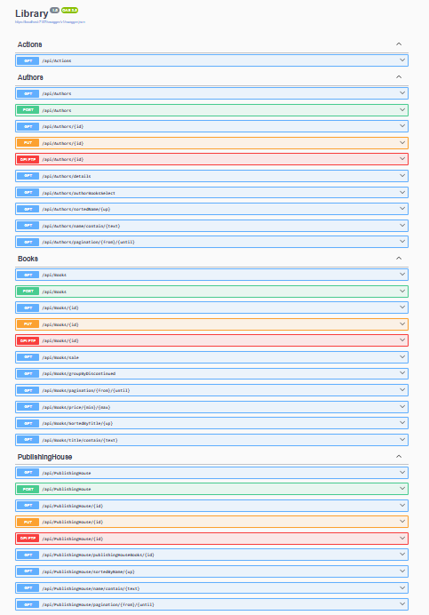

## Library
ASP.NET Core Web API Biblioteca




## appsetting.Development.json
``` 
{
  "ConnectionStrings": {
        "Connection": "Server=?;Database=Library;Trusted_Connection=True;TrustServerCertificate=True;MultipleActiveResultSets=True",
  },
  "ClaveEncriptacion": "",
    "ClaveJWT": "",
  "Logging": {
    "LogLevel": {
      "Default": "Information",
      "Microsoft.AspNetCore": "Warning"
    }
  }
}
``` 
