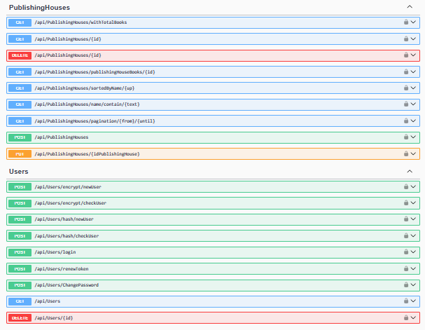

## Library
ASP.NET Core Web API Biblioteca





## Program
```cs 
builder.Services.AddDbContext<AlmacenContext>(options =>
    options.UseSqlServer(builder.Configuration.GetConnectionString("Connection"))
);
``` 

## appsetting.Development.json
```cs 
{
  "ConnectionStrings": {
        "Connection": "Server=*;Database=Library;Trusted_Connection=True;TrustServerCertificate=True;MultipleActiveResultSets=True"
}
``` 

[DeepWiki moraisLuismNet/Library](https://deepwiki.com/moraisLuismNet/Library)